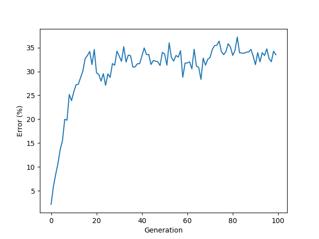

# Pix2pix plays Conway's Game Of Life
A machine learning program called [Pix2pix](https://phillipi.github.io/pix2pix/) which utilizes [Generative Adversarial Networks](https://papers.nips.cc/paper/5423-generative-adversarial-nets.pdf) *(GANs)* was trained to play [Conway's Game of Life](https://en.wikipedia.org/wiki/Conway%27s_Game_of_Life) cellular automaton. The network was trained using a dataset which consists of 100 image with 512x512 resolution. Training run 200 epochs with default settings defined by [original authors of Pix2pix](https://phillipi.github.io/pix2pix/).

## Results ##
*Video of Pix2pix playing Game of Life:*

### Error ###

The error of the machine learning network grows as the generations go. The error is calculated for each generation as a sum of the difference of each corresponding pixel in the two images. Here is a graph to demonstrate the error:

## Conclusions ##
Trained network is able to play the game but makes mistakes on the edges of the "game field" which increases the error of the network. While playing the game the error accumulates over time and therefore the end result is far apart from the actual simulation of the game. However, to the human eye, the game looks real even though there are mistakes.

## Related Work ##
- [Original Pix2pix & CycleGAN](https://github.com/junyanz/pytorch-CycleGAN-and-pix2pix)

- [DCGAN](https://github.com/soumith/dcgan.torch)
